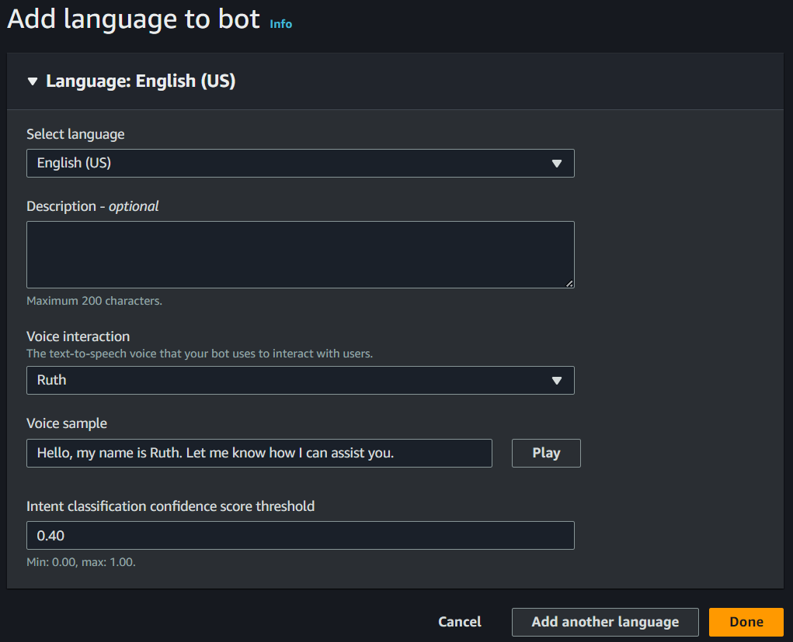
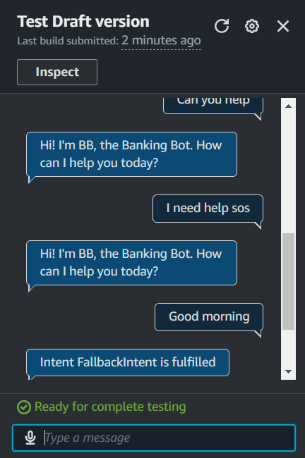
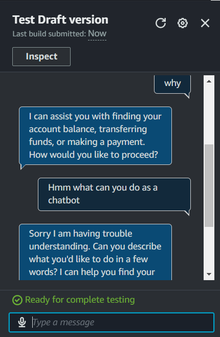

# Banker Bot Series: Part 1 - Building a Chatbot with Amazon Lex

## Table of Contents

- [Banker Bot Series: Part 1 - Building a Chatbot with Amazon Lex](#banker-bot-series-part-1---building-a-chatbot-with-amazon-lex)
  - [Table of Contents](#table-of-contents)
  - [1. Introduction:](#1-introduction)
  - [2. Setting up a Lex chatbot:](#2-setting-up-a-lex-chatbot)
  - [3. Intents:](#3-intents)
  - [4.Configuring FallbackIntent:](#4configuring-fallbackintent)
  - [5. Variations:](#5-variations)

## 1. Introduction

**What is Amazon Lex?**
Amazon Lex is a service for building voice and text chatbots using the same
technology as Alexa. It simplifies creating conversational interfaces, allowing
businesses to automate interactions and enhance user experiences.

**How I used Amazon Lex in this project**
I used Amazon Lex to create a banker bot that interacts with users through
voice and text. The bot understands banking-related intents, provides
customized responses, and automates tasks like checking account balances.

**One thing I didn't expect in this project was...**
One thing I didn't expect is how easy it is to build a chatbot with Amazon Lex!
The user-friendly interface and simple setup made the process much simpler
than I anticipated, allowing me to focus on enhancing its functionality.

**This project took me...**
This project took me less than an hour, including the documentation. The quick
setup and intuitive interface of Amazon Lex made it easy to create the banker
bot and document the process efficiently.

## 2. Setting up a Lex chatbot

I created my chatbot from scratch with Amazon Lex. Setting it up took me 2
minutes, although I spent a little extra time understanding some of the input
parameters during the setup process.

While creating my chatbot, I also created a role with basic permissions because
Amazon Lex needs the permission to call other AWS services on your behalf.
These basic permissions allow Lex to function smoothly within the AWS
environment.

In terms of the intent classification confidence score, I kept the default value of
0.40. This means that my chatbot will only respond if it is at least 40%
confident in correctly identifying the user's intent.

## 3. Intents

Intents are what the user is trying to achieve in their conversation with the
chatbot. They represent the specific goals or actions a user wants to
accomplish, such as checking a bank account balance, booking a flight, or
ordering food.

I created my first intent, WelcomeIntent, to welcome the user or customer when
they first say 'hi' or need help. This intent is designed to provide a friendly
greeting and guide the user toward the next steps in the conversation.

## 4.Configuring FallbackIntent

I launched and tested my chatbot, which could respond successfully if I enter
greetings such as 'Hi,' 'Hello,' 'I need help,' or 'Can you help me?'. These
phrases trigger the WelcomeIntent.

My chatbot returned the error message Intent FallbackIntent is fulfilled when I
entered 'Good morning.' This error message occurred because the chatbot
couldnʼt match 'Good morning' to any predefined intent.

**FallbackIntent** is a default intent that gets triggered when the chatbot cannot
confidently match the user's input to any defined intent. If the confidence score
is below 40% for all defined intents.

I wanted to configure FallbackIntent because it serves as a **custom error
message** that my chatbot uses to inform the user when it doesn't understand
their input. This ensures that users receive **clear feedback**.

## 5. Variations

To configure FallbackIntent, I defined a customized closing response so that
the chatbot will use when it fails to recognize user input.

I also added two variations! What this means for an end user is that the chatbot
can provide different responses when the FallbackIntent is triggered. This
variety helps make interactions feel more natural and engaging.

