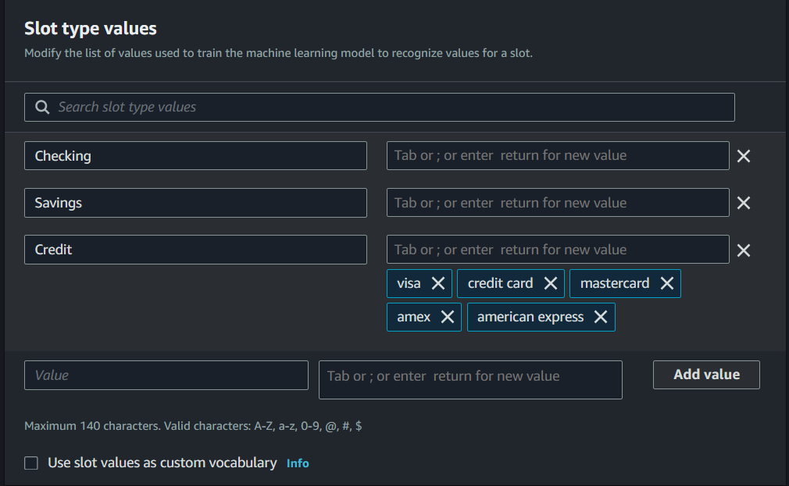
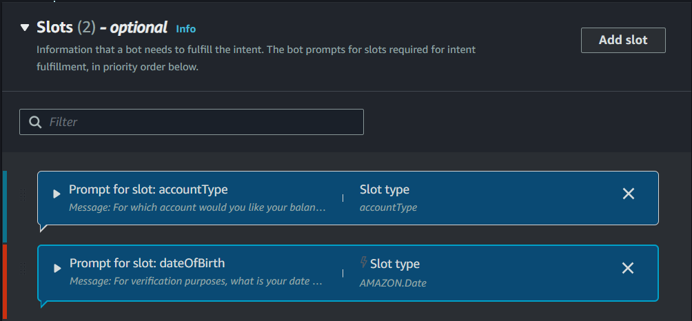
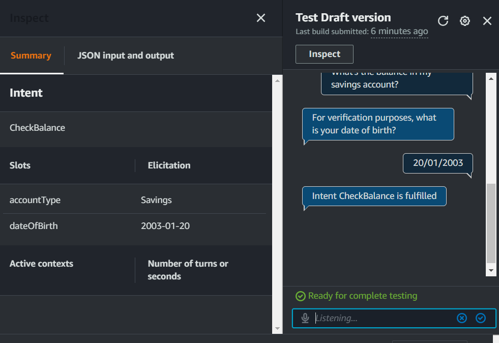

# Banker Bot Series: Part 2 - Adding Custom Slots to Your Chatbot with Amazon Lex

## Overview

Today, I used Amazon Lex to create a BankerBot, enabling users to check
their account balance effortlessly. By implementing custom slots, I
enhanced the botʼs ability to collect and store crucial user information.

## 1.Slots

Slots are **pieces of information** that a chatbot needs to complete a user's
request. Think of them as blanks that need to be filled in a form.
By adding custom slots in utterances, my chatbot's users gain a more
personalized and dynamic interaction experience. Custom slots allow the
chatbot to extract and process specific pieces of information enabling relevant
responses.
In this project, I created a custom slot type to for the account type.

## 2. Connecting slots with intents

This slot type has **restricted slot values**, which means that only the values that
you specify will count as a **valid accountType**. no extra information from users
will be valid.

I associated my custom slot with CheckBalance, which is designed when the
users request to check their account balance.

## 3. Slot values in utterances

I included slot values in some of the utterances (i.e. user inputs), in our case we have the *accountType* our *custom slot* ('savings' or 'checking'), additionally to the *dateOfBirth*
which a type of *'AMAZON.Date'*.

